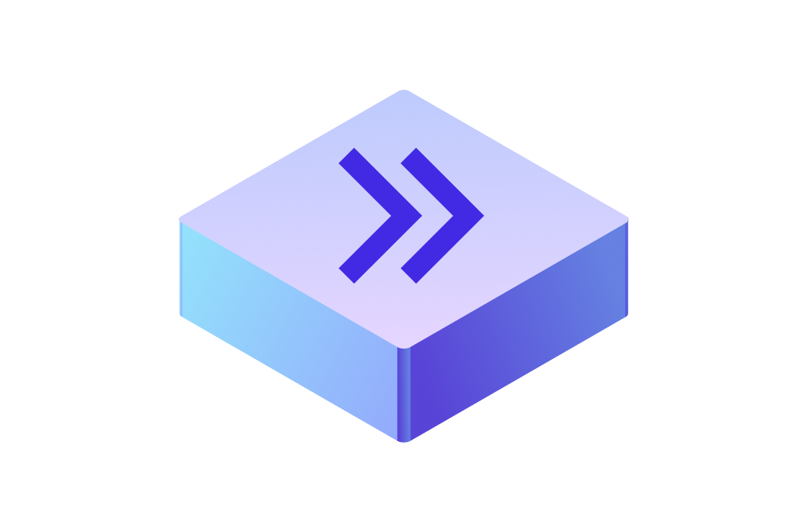

  

<h3 align="center">Nextfin</h3>

  A secure and scalable backend platform for e-banking operations
   
  <a href="https://github.com/mihavo/nextfin/issues/new?template=bug_report.md">Report bug</a>
  ·
  <a href="https://github.com/mihavo/nextfin/issues/new?labels=feature?template=feature_request.md">Request feature</a>

  

## Table of Contents

- [Overview](#overview)
- [Features](#features)
- [Quick Start](#quick-start)
- [Documentation](#documentation)
- [License](#license)

## 📖 Overview

The **e-Banking Platform API** is a comprehensive RESTful backend platform designed to enhance digital banking
experiences.  
It offers a suite of features that enable seamless financial management and transactions for users.

## 🌟 Features

- ✅ Secure Authentication – Robust mechanisms to ensure user data protection.
- 💰 Transaction Management – Perform operations like deposits, withdrawals, and transfers.
- 💳 Payment Processing – Facilitate seamless payments to organizations and service providers.
- 📊 Portfolio Management – Tools for overseeing and managing investment portfolios.
- 🏦 Account Services – Access account details, balances, and transaction histories.
- 🔔 Real-Time Notifications – Stay updated with instant alerts on account activities.

## 🚀 Quick Start

Bootstrap the application with one of the following options:

- [Download The Latest Release](https://github.com/mihavo/nextfin/releases)
- [Build From Source](https://github.com/mihavo/nextfin/wiki/Guide-%E2%80%90-Build-from-Source)

## 📚 Documentation

For detailed API documentation and usage guides, visit
the [Nextfin Documentation](https://github.com/mihavo/nextfin/wiki/Nextfin-Docs).

## 📜 License

This project is licensed under the MIT License. See the [LICENSE](https://github.com/mihavo/nextfin/LICENSE) file for
details.
